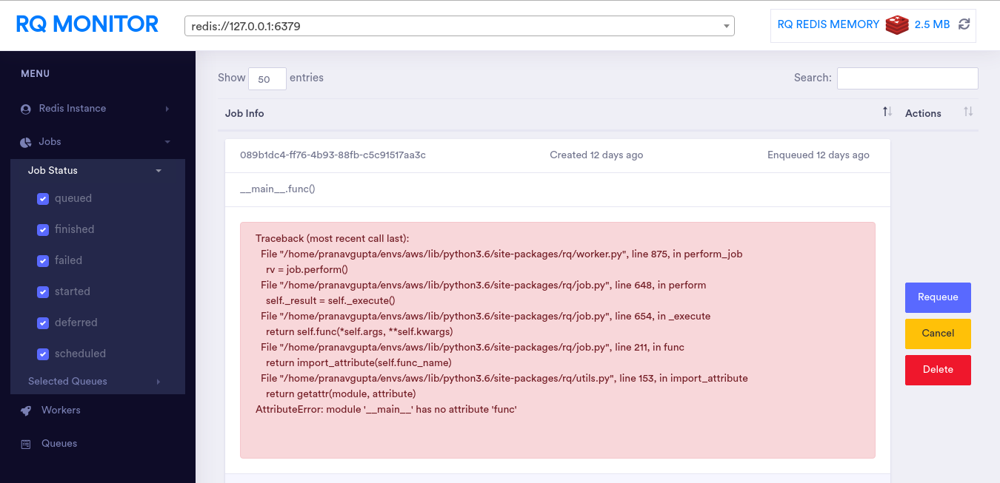

<h1 align="center">
  <br>
  <a href="#"></a>
  <br>
  RQMonitor
  <br>
</h1>

<h4 align="center">RQ Monitor is Flask based more actionable and dynamic web frontend for monitoring your RQ.</h4>

<p align="center">
  <a href="https://opensource.org/licenses/Apache-2.0">
    
  </a>
  <a href="https://pypi.org/project/rqmonitor/">
    
  </a>
  <a href="https://pypi.org/project/rqmonitor/">
    
  </a>
  <a href="https://github.com/pranavgupta1234/rqmonitor/issues">
    
  </a>
  <a href="https://github.com/pranavgupta1234/rqmonitor/pulls">
    
  </a>
</p>

<p align="center">
  <a href="#key-features">Key Features</a> •
  <a href="#install">Install</a> •
  <a href="#usage">Usage</a> •
  <a href="#credits">Credits</a> •
  <a href="#contribute">Contribute</a> •
  <a href="#similar-tool">Similar Tool</a> •
  <a href="#license">License</a>
</p>



## Key Features

* Redis RQ Memory monitoring - Implemented through Lua Scripting
  - Possibly RQ is only using some subset of your redis and some other important data is also you want to keep a close eye on memory
* All data through DataTables:
  - All jobs, queues, workers are rendered by DataTables so you get additional functionality of sorting, searching, robust pagination.
* More Ajax less reloading
  - Once after firing up the dashboard no refresh is necessary, almost every refresh is done via ajax.  
* Jobs Filtering Support
  - You can choose jobs from certain queue with certain status
* Send Signals to Workers
  - Maybe you want to kill some workers and feel too lazy to open up the RQ instance, don't worry rqmonitor has your back, directly send signals to your workers.
* Highly Scalable Jobs Dashboard
  - Jobs datatable is implemented via serverside with ajax pipelining 
* Last but not the least is beautiful UI
* More features coming!


## Install

1. Install with [`pip`](https://pypi.org/project/rqmonitor/)
    + `$ pip install rqmonitor`


## Usage

Download latest version of rqmonitor from pypi and fire up your command line and type `rqmonitor --help`.

```
Usage: rqmonitor [OPTIONS]

  Run the RQ Monitor Flask server.

  All configuration can be set on the command line or through environment
  variables of the form RQ_MONITOR_*. For example RQ_MONITOR_USERNAME.

  A subset of the configuration (the configuration parameters used by the
  underlying flask blueprint) can also be provided in a Python module
  referenced using --config, or with a .cfg file referenced by the
  RQ_MONITOR_SETTINGS environment variable.

Options:
  -b, --bind TEXT                 IP or hostname on which to bind HTTP server
  -p, --port INTEGER              Port on which to bind HTTP server
  --url-prefix TEXT               URL prefix e.g. for use behind a reverse
                                  proxy
  --username TEXT                 HTTP Basic Auth username (not used if not
                                  set)
  --password TEXT                 HTTP Basic Auth password
  -c, --config TEXT               Configuration file (Python module on search
                                  path)
  -u, --redis-url TEXT            Redis URL. Can be specified multiple times.
                                  Default: redis://127.0.0.1:6379
  --refresh-interval, --interval INTEGER
                                  Refresh interval in ms
  --extra-path TEXT               Append specified directories to sys.path
  --debug / --normal              Enter DEBUG mode
  -v, --verbose                   Enable verbose logging
  --help                          Show this message and exit.
```


## Credits

This software majorly uses the following open source packages:

- flask
- rq
- nunjucks


## Contribute
---

1. Clone repo and create a new branch: `$ git checkout https://github.com/pranavgupta1234/rqmonitor -b name_for_new_branch`.
2. Make changes and test
3. Submit Pull Request with comprehensive description of changes


## Similar Tool

- [rq-dashboard](https://github.com/Parallels/rq-dashboard) - Yet another RQ Dashboard


## License

Apache
